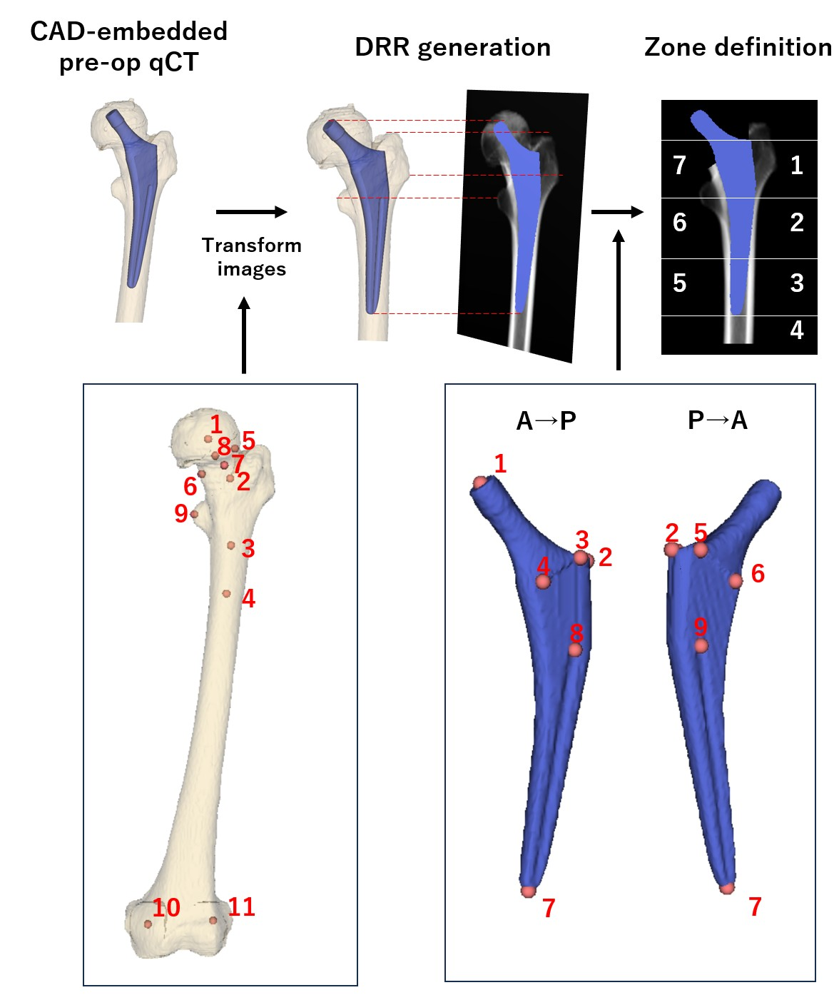

# **Calculation of Gruen-zone-BMD**

The codes in this repository are used to quantify the bone density of the Gruen zones from CT images.



## Requirements
- MATLAB 

## Pre-processing
- Femur segmentation (Segmented by the model in [Femur_segmentation](https://github.com/keisuke-uemura/Femur_segmentation))
- Landmarks of the proximal femur selected by an AI trained model (https://github.com/NAIST-ICB/LandmarkDetection) 
- Calibration phantom segmentation (Segmented by models in [Phantom-segmentation](https://github.com/keisuke-uemura/CT-Intensity-Calibration-Phantom-Segmentation))
- Registered CAD model (stem CAD model registered to preoperative CT images)

## Required input information for each case (saved in json file)
For a sample of json file, please see [sample_setup.json](/sample/sample_setup.json)
- CT images (saved as .mhd)
- Segmented label (from U-net, saved as .mhd)
- CAD model registered to preoperative CT images (saved as .mhd)
- Eleven landmarks from the femur (from 3D slicer, saved as .fcsv)<dt>Head neck junction (superior, inferior, anterior, posterior)</dt> Shaft (2cm distal from the lesser trochanter, 5cm distal from the lesser trochanter)</dt>  <dt>Head center</dt> <dt>Neck center </dt> <dt>lesser trochanter </dt> <dt>Medial posterior condyle </dt> <dt>Lateral posterior condyle
- Nine landmarks from the registered stem CAD model (saved as .fcsv)<dt>

- Slope and intercept of the regression model (from phantom segmentation)


## Usage

```bash
Gruen_zone_BMD_measurements.m
```
- Required functions 
  <dt>Gruen_transformation.m</dt>
  <dt>Gruen_measurement.m</dt>
  <dt>Gruen_measurement.m</dt>

# Licence
Codes can be used for research purpose or for educational purpose.

For details, please see [LICENCE.txt](LICENCE.txt)
